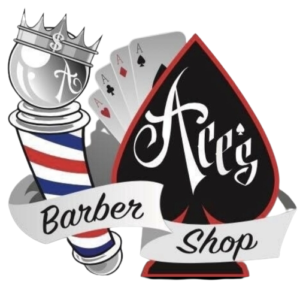

<p align="center">
  
</p>

<p align="center">
<strong>Ace's Barbershop Website by Team A Cup of Java</strong>
</p>

## Table of Contents

--- 

- [Team Members](#team-members)
- [Background](#background)
- [Solution](#solution)
- [Prototype](#prototype)
- [Timeline](#timeline)
- [Website Demo](#website-demo)
- [Testing](#testing)
  - [Functional Test: Automation via Selenium](#functional-test-automation-via-selenium)
  - [Functional Test: User Interaction](#functional-test-user-interaction)
    - [Functional Test: User Interaction Tools](#functional-test-user-interaction-tools)
    - [Functional Test: User Interaction Setup](#functional-test-user-interaction-setup)
  - [Unit Test: API Testing](#unit-test-api-testing)
    - [Unit Test: API Testing Tools](#unit-test-api-testing-tools)
    - [Unit Test: API Testing Setup](#unit-test-api-testing-setup)
- [Run and Deploy](#run-and-deploy)
  - [Run](#run)
    - [**Terminal**](#terminal)
    - [**Command Prompt**](#command-prompt)
    - [**Run Server**](#run-server)
      - [To run using Nodemon and have Developer control run](#to-run-using-nodemon-and-have-developer-control-run)
      - [To launch the app run](#to-launch-the-app-run)
  - [Deploy](#deploy)

## Team Members

---

<p align="center">
  
</p>

- [@Valentin Bakalor](https://github.com/Val2049)
  - **Email:** ValBakalor@gmail.com
- [@Bunpheng Chhay](https://github.com/Bunphengchhay)
  - **Email:** bunphengchhay@gmail.com
- [@Faizan Ul Islam](https://github.com/FizzyPop007)
  - **Email:** faizan.khan.gr8@gmail.com
- [@Theo McDonald](https://github.com/TheoMcDonald)
  - **Email:** mcdonaldtheo7@gmail.com
- [@Kenny Nguyen](https://github.com/Kennypnguyen)
  - **Email:** kennyypnguyen@gmail.com
- [@Thomas Nguyen](https://github.com/NguyenSt3r)
  - **Email:** ThomasDuyNguyenViet@gmail.com
- [@Vibhore Sagar](https://github.com/Vib1240n)
  - **Email:** vibhorsgr@gmail.com
- [@Alex Smith](https://github.com/arsmith97)
  - **Email:** alex@s3v.us

## Background

---

Ace’s Barbershop – Fairly new barbershop in West Sacramento, Now that they have developed their clients relations they want to take their barbershop into a new direction. They are finally going online for bookings, pricings and services available.

## Solution

---

Creating a website with all the barbers listed with their schedules and specialities. Customers get to see the recent haircuts from the barbers and be able to make appointments right from the website instead of calling the shop to verify.

## Prototype

---

<p align="center">

</p>

<br>
As part of our designing phase, we developed a figma clickable prototype that showcases all the views of Ace’s Barbershop website. When designing our prototype, we wanted to make sure we included all the features the client requested. To achieve this, we developed each feature as a view for the website. For example, we created an appointments view that will allow customers with an account to schedule an appointment which is one the features the client wishes to have. Another feature that was incorporated into a view of the website was the sign in feature. We created a view that would allow customers to sign in to their account so that they can schedule their appointment. They are also giving the option to sign up if they are new. To implement all these views together, we incorporated a navigation bar on the top of the website that links all the views of the website. Within our prototype, we were able to make the navigation bar clickable so that our client will be able to see all the views and experience the flow of the website. The goal of this prototype was to present an idea of the website to our client and then receive feedback on things they liked and disliked.

## Timeline

---

<p align="center">

</p>

## Website Demo

---

<p align="center">

</p>                                                             
                                                             
<br>
This section will provide GIF that showcases a walkthrough of the deployed Ace's Barbershop Website.

## Testing

---

<br>
This section will provide a description of all the tests that were performed for Ace's Barbershop Website.

### Functional Test: Automation via Selenium:
<br>
One of the tests we used for Ace’s Barbershop Website was functional tests using automation (Selenium). There are three test cases that include the Selenium automated software navigating through the website using Navbar, the Selenium automated software navigating through the website using Sidebar, and the Selenium automated software signing in using email and password provided by tester/user. If the user would like to learn how to perform these tests please follow this GitHub Repository Link (https://github.com/Kennypnguyen/Ace-Barbershop-Website-Tests)

### Functional Test: User Interaction
<br>
The second test we used was  functional tests using User interaction. These include user signing up, signing in, requesting an appointment, viewing user profile information, viewing previous and upcoming requested appointments, and signing out. Not only are these tests ensuring that the user can interact with the features, but also that certain error messages are displayed in the front end whenever a user performs the feature incorrectly. To run these tests:

#### Functional Test: User Interaction Tools

- Windows Operating System (Windows 10 or above) or MacOS
- Any web browser is okay (Google Chrome was used to perform these tests in the System Test Report)
- Ace’s Barbershop Website Link: https://www.acesbarber.shop 

#### Functional Test: User Interaction Setup

- To run these tests, you first need to run the Ace’s Barbershop Website. The link is provided in the tools above. Then just follow the steps provided in each of the test cases in the System Test Report Section 3.0 Functional Test: Tester Interaction.
- An example test case would be when the user is signing in with a valid email. Here the tester would navigate to Sign In View and sign in with a valid email and password (meaning that the email and password has been signed up in Ace’s Barbershop Website). The expected result of this test case should the user/tester being signed in and navigated to Profile View
- Another example test case would be if the user is signing in with a valid email but incorrect password. Here the tester would navigate to Sign In View and sign in with a valid email (email has been signed up in Ace’s Barbershop Website) but incorrect password (password not associated with the email). The expected result is that user/tester is not signed in but is greeted with a pop up message stating “Incorrect Password or Email” 

### Unit Test: API Testing
<br>
The last set of tests we did for Ace’s Barbershop Website were unit testing specifically testing the APIs of the website. During the Sprints 05-07, before our team pushed any changes to our GitHub, we performed tests on our APIs to ensure that they worked properly by making sure it is either sending to the server or retrieving data from server. The team performed these tests using Postman. To perform these tests:

#### Unit Test: API Testing Tools

- Windows Operating System (Windows 10 or above) or MacOS 
- Any web browser is okay (Google Chrome was used to perform these tests in the System Test Report)
- Postman
  - Link: https://www.postman.com/ 
- Ace’s Barbershop Website Link: https://www.acesbarber.shop 

#### Unit Test: API Testing Setup

- To run these tests, you first need to run the Ace’s Barbershop Website. The link is provided in the tools above.
- After the website is running, navigate to the Postman browser (link in tools) and create an account.
- Once signed in, navigate to your workspace by clicking on workspaces on the top left. Then click on “My workspace”.
- Once at “My Workspace”, select your postman agent to “Desktop Agent” on the bottom right. The tester must download “Desktop Agent” to perform these tests.
- While still in “My workspace”, click on the new tab to begin a request. The requests will be either GET or POST. Then follow the steps to follow each test in section 4.0 Unit Test: API Testing.
- An example test case would be Sign In API where the steps are:
  - First selecting POST in the drop down menu. 
  - Then the tester will provide **“https://www.acesbarber.shop/api/login”** in the request URL text field. 
  - Next the tester will click on the “body” text option. 
  - Then select on the “raw” option and select “JSON” for the language in the drop down menu.
  - Then type the following in the body:
    ```
    {
      “username” : “[valid email]”,
      “password” : “[valid password]”
    }
    ```
      **Note**: Valid email and password means it is already registered. Must include “” marks as listed in step 5.
  - Once the tester has followed the steps above. Click on the “Send” button to send the request.
  - The result will be provided in the response field at the bottom. The response will be a in a form of status code (Example: 200 series OK, 300 series REDIRECTION,   400 series BAD REQUEST, and 500 series INTERNAL SERVER ERROR)
    - For this test, the user/tester should expect a status code 200 OK code and should return a **“Login Successful”** in the response body.
    
## Run and Deploy

---

<br>
This section will inform the reader how to run the website locally and how the team deployed Ace's Barbershop Website.

### Run

<br>
This subsection will provide instructions on how to run the website locally.
<br>
<br>
Clone the repository to run the project locally using

    git clone git@github.com:Vib1240n/A-Cup-Of-Java.git

After Cloning the repository, make sure you have Node installed, to check for Node

#### **Terminal**

    Node --v
    npm --v

#### **Command Prompt**

    Node -v

After making sure you are up and running the latest version of Node, Open up the Project in the IDE/Code editor of choice to install dependencies. To install Dependencies run
` npm install` from the Terminal/Command prompt.<br> Make sure you are installing dependencies in the Project directory and not globally.
<br>
<br>

#### **Run Server**

After installing dependencies run<br>

##### To run using Nodemon and have Developer control run

```
npm run devStart
```

##### To launch the app run

```
node server.js
```

As of right now the server will run the website on

> http://localhost:5500


### Deploy

<br> This subsection will provide a description on how the team deployed Ace's Barbershop Website.
